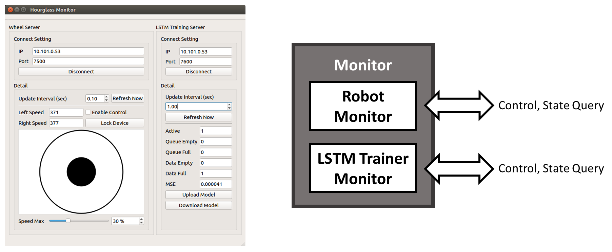

# Hourglass: A Online Learning Robot Tracking System

### Introduction

Traditionally, using fuzzy or PID control system to deal with tracking problem needs a lot of time wasted on parameter tuning.
In order to reduce the time and efforts on control parameter optimization, we build a online learning system with LSTM (Long Short-Term Memory) and RL (Reinforcement Learning).

### Project Dependences

Open source:
- [OpenCV](https://opencv.org/)
- [libserialport](https://sigrok.org/wiki/Libserialport)

Personal project (used as git submodule):
- [args](../../args): Summarizing program arguments.
- [CSV_DataProc](../../CSV_DataProc): Reading CSV format file.
- [laneft](../../laneft): Control feature processing.
- [lstm](../../lstm): Long Short-Term Memory (LSTM) library.
- [ModConfig](../../ModConfig): Reading configure file.
- [SimplePID](../../SimplePID): A very simple PID controller.
- [tcpmgr](../../tcpmgr): Managing TCP conntection.
- [Wheel](../../Wheel): Robot wheel controll module.
- [Wheel_Server](../../Wheel_Server): Robot wheel controll server.

The links is provided as project relative links.
Please view this README in project homepage.

### Feature extraction

To control robot tracking on lane, we use a camera to provide a lane image.
Then do the following processing to get control offset:

- Canny edge detection.
- Recursive neighbor search for line generation.
- Control offset calculation.

### Initial state building

The LSTM initial control model is based on dataset collected with simple PID controller (slow but stable).

Video demo:

### Reinforcement learning

In reinforcement learning task, the robot will keep running on lane in order to collect new control data and renew control data through RL rule.
Then renewed datas will be sent to the training server.
After 2500 (configurable argument) instances of data been sent, the robot will ask training server for a new LSTM control model.

Video demo:

### Final state

After reinforcement learning, the control performance improvement is noticeable.

Video demo:

Video demo (reserve):

### System Architecture

The system could be separated to three individual part, communcating with TCP connection. The online learning feature is combined with two parts, robot and LSTM trainer.

LSTM trainer architecture:

Robot architecture:

Monitor architecture:

### Experimental Result

The experiment is run with the rule below:

After 51 times control model update, running speed average is increased to 60%.
Control speed average logs of initial model and final model are shown in right side of the picture.

